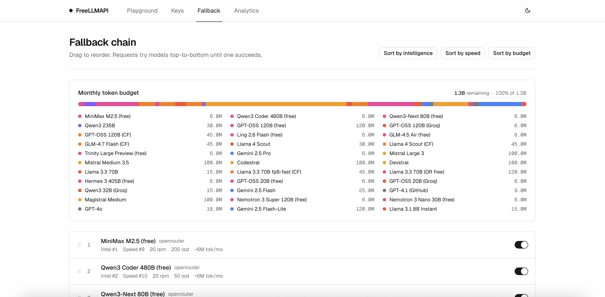

# FreeLLMAPI

**One OpenAI-compatible endpoint. Eleven free LLM providers. ~1B+ tokens per month.**

Aggregate the free tiers from Google, Groq, Cerebras, SambaNova, NVIDIA, Mistral, OpenRouter, GitHub Models, Cohere, Cloudflare, and Z.ai (Zhipu) behind a single `/v1/chat/completions` endpoint. Keys are stored encrypted. A router picks the best available model for each request, falls over to the next provider when one is rate-limited, and tracks per-key usage so you stay under every free-tier cap.

---

## Contents

- [Why this exists](#why-this-exists)
- [Supported providers](#supported-providers)
- [Features](#features)
- [Not yet supported](#not-yet-supported)
- [Quick start](#quick-start)
- [Using the API](#using-the-api)
- [Screenshots](#screenshots)
- [How it works](#how-it-works)
- [Limitations](#limitations)
- [Contributing](#contributing)
- [Terms of Service review](#terms-of-service-review)
- [Disclaimer](#disclaimer)

## Why this exists

Every serious AI lab now offers a free tier — a few million tokens a month, a few thousand requests a day. On its own each tier is a toy. Stacked together, they add up to roughly **1.3 billion tokens per month** of working inference capacity, across dozens of models from small-and-fast to reasonably capable.

The problem is that stacking them by hand is painful: fourteen different SDKs, fourteen different rate limits, fourteen places a request can fail. FreeLLMAPI collapses that into one OpenAI-compatible endpoint. Point any OpenAI client library at your local server, and it routes transparently across whichever providers you've added keys for.

## Supported providers

<table>
<tr>
<td align="center" width="180"><a href="https://ai.google.dev"><b>Google</b> Gemini 2.5 Flash · 3.x previews</a></td>
<td align="center" width="180"><a href="https://groq.com"><b>Groq</b> Llama 3.3, Llama 4, GPT-OSS, Qwen3</a></td>
<td align="center" width="180"><a href="https://cerebras.ai"><b>Cerebras</b> Qwen3 235B</a></td>
<td align="center" width="180"><a href="https://cloud.sambanova.ai"><b>SambaNova</b> DeepSeek V3.x · Llama 4 · Gemma 3</a></td>
</tr>
<tr>
<td align="center"><a href="https://mistral.ai"><b>Mistral</b> Large 3 · Medium 3.5 · Codestral · Devstral</a></td>
<td align="center"><a href="https://openrouter.ai"><b>OpenRouter</b> 19 free-tier models</a></td>
<td align="center"><a href="https://github.com/marketplace/models"><b>GitHub Models</b> GPT-4.1 · GPT-4o</a></td>
<td align="center"><a href="https://developers.cloudflare.com/workers-ai"><b>Cloudflare</b> Kimi K2 · GLM-4.7 · GPT-OSS · Granite 4</a></td>
</tr>
<tr>
<td align="center"><a href="https://cohere.com"><b>Cohere</b> Command R+ · Command-A (trial)</a></td>
<td align="center"><a href="https://docs.z.ai"><b>Z.ai (Zhipu)</b> GLM-4.5 · GLM-4.7 Flash</a></td>
<td align="center"><a href="https://build.nvidia.com"><b>NVIDIA</b> NIM (disabled by default)</a></td>
<td align="center"><i>Adding another? See <a href="#contributing">Contributing</a>.</i></td>
</tr>
</table>

## Features

- **OpenAI-compatible** — `POST /v1/chat/completions`, `POST /v1/completions`, and `GET /v1/models` work with the official OpenAI SDKs and any OpenAI-compatible client (LangChain, LlamaIndex, Continue, Hermes, etc.). Just change `base_url`.
- **Legacy completions** — `POST /v1/completions` wraps chat completions behind the classic text completion interface. Supports `prompt` (string or array), `suffix`, `echo`, `n`, `stream`, and all standard knobs.
- **Streaming and non-streaming** — Server-Sent Events for `stream: true`, JSON response otherwise. Every provider adapter implements both.
- **Tool calling** — OpenAI-style `tools` / `tool_choice` requests are passed through, and assistant `tool_calls` + `tool` role follow-up messages round-trip across providers.
- **Vision / multimodal inputs** — Image content via `image_url` parts in message content arrays. Google's Gemini gets translated to `inlineData` (base64) or `fileData` (URL). OpenAI-compatible providers receive native `image_url` parts.
- **Parallel generation (`n > 1`)** — Send `n` > 1 in a non-streaming chat completion request and FreeLLMAPI fires parallel requests to the same provider, returning merged `n` choices in a single response.
- **Automatic fallover** — If the chosen provider returns a 429, 5xx, or times out, the router skips it, puts the key on a short cooldown, and retries on the next model in your fallback chain (up to 30 attempts).
- **Per-key rate tracking** — RPM, RPD, TPM, and TPD counters per `(platform, model, key)` so the router always picks a key that's under its caps.
- **Sticky sessions** — Multi-turn conversations keep talking to the same model for 30 minutes to avoid the hallucination spike that comes from mid-conversation model switches.
- **Encrypted key storage** — API keys are encrypted with AES-256-GCM before hitting SQLite; decryption happens in-memory just before a request.
- **Unified API key** — Clients authenticate to your proxy with a single `freellmapi-…` bearer token. You never expose upstream provider keys to your apps.
- **Health checks** — Periodic probes mark keys as `healthy`, `rate_limited`, `invalid`, or `error` so the router skips dead ones automatically.
- **Admin dashboard** — React + Vite UI to manage keys, reorder the fallback chain, toggle free models in bulk, inspect analytics, and run prompts in a playground. Dark mode included.
- **Analytics** — Per-request logging with latency, token counts, success rate, and per-provider breakdowns.
- **Deploys to a Raspberry Pi** — Runs happily on a Pi 4 under PM2 behind nginx. ~40 MB RSS at idle.

## Not yet supported

The scope is deliberately narrow. If a feature isn't on this list, assume it isn't there yet.

- **Embeddings** (`/v1/embeddings`)
- **Image generation** (`/v1/images/*`)
- **Audio / speech** (`/v1/audio/*`)
- **Moderation** (`/v1/moderations`)
- **Per-user billing / multi-tenant auth** — single-user by design

PRs that add any of these are very welcome. See [Contributing](#contributing).

[MIT](./LICENSE)
