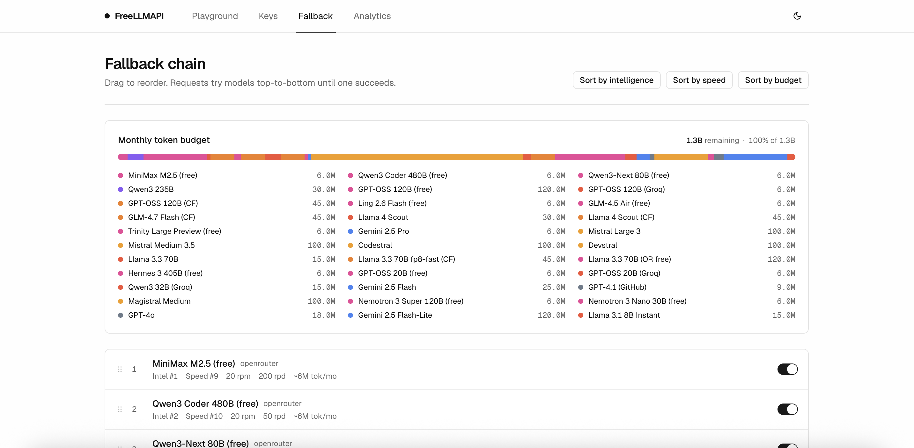

<div align="center">

# FreeLLMAPI

**One OpenAI-compatible endpoint.**

Aggregate the free tiers from Google, Groq, Cerebras, SambaNova, NVIDIA, Mistral, OpenRouter, GitHub Models, Cohere, Cloudflare, and Z.ai (Zhipu) behind a single `/v1/chat/completions` endpoint. Keys are stored encrypted. A router picks the best available model for each request, falls over to the next provider when one is rate-limited, and tracks per-key usage so you stay under every free-tier cap.

[](./LICENSE)
[](#contributing)



</div>

---


## Features

- **OpenAI-compatible** — `POST /v1/chat/completions`, `POST /v1/completions`, and `GET /v1/models` work with the official OpenAI SDKs and any OpenAI-compatible client (LangChain, LlamaIndex, Continue, Hermes, etc.). Just change `base_url`.
- **Legacy completions** — `POST /v1/completions` wraps chat completions behind the classic text completion interface. Supports `prompt` (string or array), `suffix`, `echo`, `n`, `stream`, and all standard knobs.
- **Streaming and non-streaming** — Server-Sent Events for `stream: true`, JSON response otherwise. Every provider adapter implements both.
- **Tool calling** — OpenAI-style `tools` / `tool_choice` requests are passed through, and assistant `tool_calls` + `tool` role follow-up messages round-trip across providers.
- **Vision / multimodal inputs** — Image content via `image_url` parts in message content arrays. Google's Gemini gets translated to `inlineData` (base64) or `fileData` (URL). OpenAI-compatible providers receive native `image_url` parts.
- **Parallel generation (`n > 1`)** — Send `n` > 1 in a non-streaming chat completion request and FreeLLMAPI fires parallel requests to the same provider, returning merged `n` choices in a single response.
- **Automatic fallover** — If the chosen provider returns a 429, 5xx, or times out, the router skips it, puts the key on a short cooldown, and retries on the next model in your fallback chain (up to 30 attempts).
- **Per-key rate tracking** — RPM, RPD, TPM, and TPD counters per `(platform, model, key)` so the router always picks a key that's under its caps.
- **Sticky sessions** — Multi-turn conversations keep talking to the same model for 30 minutes to avoid the hallucination spike that comes from mid-conversation model switches.
- **Encrypted key storage** — API keys are encrypted with AES-256-GCM before hitting SQLite; decryption happens in-memory just before a request.
- **Unified API key** — Clients authenticate to your proxy with a single `freellmapi-…` bearer token. You never expose upstream provider keys to your apps.
- **Health checks** — Periodic probes mark keys as `healthy`, `rate_limited`, `invalid`, or `error` so the router skips dead ones automatically.
- **Admin dashboard** — React + Vite UI to manage keys, reorder the fallback chain, toggle free models in bulk, inspect analytics, and run prompts in a playground. Dark mode included.
- **Analytics** — Per-request logging with latency, token counts, success rate, and per-provider breakdowns.
- **Deploys to a Raspberry Pi** — Runs happily on a Pi 4 under PM2 behind nginx. ~40 MB RSS at idle.

## Not yet supported

The scope is deliberately narrow. If a feature isn't on this list, assume it isn't there yet.

- **Embeddings** (`/v1/embeddings`)
- **Image generation** (`/v1/images/*`)
- **Audio / speech** (`/v1/audio/*`)
- **Moderation** (`/v1/moderations`)
- **Per-user billing / multi-tenant auth** — single-user by design

PRs that add any of these are very welcome. See [Contributing](#contributing).

## Quick start

`getmodelsapi` lives in a git submodule, so a plain `bun install` after a fresh `git clone` will fail with `Workspace not found "getmodelsapi"` (bun validates workspace paths before running any `preinstall` hook). Use the bundled `setup` script instead — it initializes the submodule (with a `git clone` fallback for repos where the submodule isn't fully wired up) and then runs `bun install`:

```bash
git clone https://github.com/nglmercer/freellmapiV2
cd freellmapiV2
bun run setup      # inits the getmodelsapi submodule, runs bun install, seeds .env
cp .env .env.local # optional — keep secrets out of the tracked file
bun run dev
```

If you already ran `git clone --recurse-submodules`, you can skip straight to `bun install`.

[MIT](./LICENSE)
